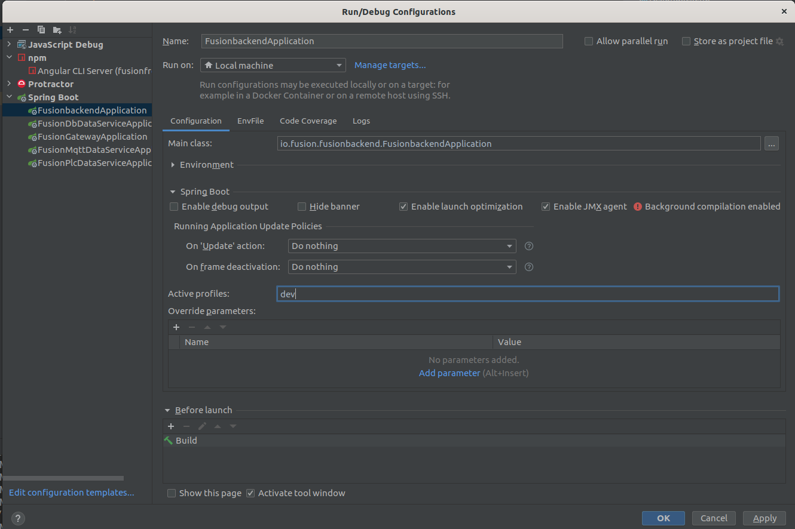
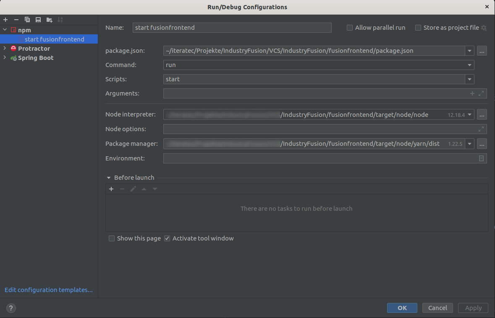

<!--
 Licensed under the Apache License, Version 2.0 (the "License");
 you may not use this file except in compliance with the License.
 You may obtain a copy of the License at

   http://www.apache.org/licenses/LICENSE-2.0

 Unless required by applicable law or agreed to in writing,
 software distributed under the License is distributed on an
 "AS IS" BASIS, WITHOUT WARRANTIES OR CONDITIONS OF ANY
 KIND, either express or implied.  See the License for the
 specific language governing permissions and limitations
 under the License.
-->

#Set-Up Guide for local Development Environment for IndustryFusion
This guide is intended to be used by developer to set up a local development environment, mostly based on Intellj IDEA and Docker. 


# Setup Development Environment
## Prerequisites
Software needed to be installed on your system:
1. Git Client: version >= 2.31.1
1. Docker (or other Container-Runtime). Docker: version >=19.03.12 
1. OpenJDK: version >= 11.0.10
   1. Think about using [SDKMAN!](https://sdkman.io/)
1. PostgreSQL-Client choose by your own. E.g.:
   1. Preferred: Intellij integrated Data-Grid
   1. Alternative: [pgadmin4](https://www.pgadmin.org/download/)
1. Intellij Ultimate Edition: version >= 2021.1.1


## Prepare Infrastructure: Database and Authentication

### Database: Postgresql
ToDo (IF-200): Es existiert eine docker-compose-Datei mit anderer Image-Konfiguration. Klären! Was ist in der Produktion?

#### Run Docker Container

for the initial start use this:
```
docker run -d --name postgres-104 -p 5432:5432 -e POSTGRES_PASSWORD=postgres -e POSTGRES_DB=postgresdb postgres:10.4
```

for the second time use:
```
 docker start postgres-104
```

### Authentication: Keycloak
- ToDo (IF-200): Auch über docker-compose abbilden.
- ToDo (IF-200): Es gibt auch die Möglichkeit die Initialisierung gleich beim Container-Start zu machen. Siehe https://github.com/keycloak/keycloak-containers/blob/12.0.4/server/README.md

Do the steps based on the [keycloak setup instructions](keycloaksetup.md)


### Object Storage Database: MinIO (or other s3-compatible DBs)

#### Run Docker Container

Follow the instructions on [minio docker quickstart guide](https://docs.min.io/docs/minio-docker-quickstart-guide.html).

#### Storage architecture

All bucket names must end with `company<companyId according to DB>`, but can have any prefix (see next point).
If you host more than one company ensure that each bucket has its own user / access credentials.

#### Extend application.yaml of Backend

Add the following to your application-local_dev-cluster.yaml of the backend and replace content within <...>:

```
object-storage:
    server-type: <minio or s3>
    server-url: <your url>
    buckets-prefix: if
```

#### Add Secret and ApiKey to Keycloak User

To access the bucket of a specific company, the backend gets the ApiKey and SecretKey from keycloak. Therefore, we have to add them to the keycloak user:

1. Login into admin console of keycloak
2. Users -> view all users -> click Edit on user
3. Switch to tab attributes
4. Add the following keys: `S3_API_KEY` and `S3_SECRET_KEY`. You get their values from the database user. 


### Alerta API Including Database

[Alerta](https://docs.alerta.io/api/reference.html) is used for intelligent alert handling and offers an API.

#### Run Docker Compose

As described [here](https://github.com/alerta/docker-alerta), within the setup folder, Alerta using a postgresql-db can be run with this command:

```
docker-compose -f docker-compose-alerta.yaml -p if-alerta up
```

The web UI can be reached at port [8082](http://localhost:8082/). Stop it with:

```
docker-compose -f docker-compose-alerta.yaml down
```

In IntelliJ, you can connect to the database `postgres` via the URL `jdbc:postgresql://localhost:5433/postgres` and the user `postgres` with the password `postgres`.

There is a postman collection for calls on the local alerta instance.

### Scorpio NGSI-LD Broker

See [GitHub](https://github.com/ScorpioBroker/ScorpioBroker/) for more information on Scorpio Broker.
 To set up, run this:

```
docker-compose -f docker-compose-ngsi-ld.yml -p if-ngsi-ld up
```

#### Generate URNs

Import [ngsi-ld.postman_collection.json](./postman/ngsi-ld.postman_collection.json) in postman.
With editing the body of the `asset post` request new database entries can be generated.


## Checkout IndustryFusion application

The project is [hosted on GitHub](https://github.com/IndustryFusion/IndustryFusion).

1. Thus clone from there:  
   ```git clone https://github.com/IndustryFusion/IndustryFusion.git```
1. Switch to branch `develop`

## Open project in Intellij
1. Choose menu "File > New > Project from Existing Sources..."
1. Select POM File of the root folder (IndustryFusion/pom.xml) and click "OK"
1. Run `mvn install` from terminal or the Maven tool window within the fusionfrontend module to automatically install node, yarn and the node modules to the "target" folder.

ToDo (IF-201): Build schlägt aktuell beim fusion-aggregator fehl

## Configure Intellij 

1. Choose menu "File > Project Structure...". Assure that your local java 11 sdk is selected below "Project Settings > Project > Project SDK"
1. In order to be able to review and comment on Github pull requests, you need to provide a *Personal Access Token*.
    1. Option 1: Initial set-up: Open the tab "Pull Requests" and choose "Log In with Token...".  
    1. Option 2: Already set-upped: Go to `File | Settings | Version Control | GitHub` and delete the old login and add a new one with "Log In with Token ...".
    1. Final token generation: Choose "Generate". After having logged in, grant the "write:discussion" permission and hit "Generate token". Copy the generated token into IntelliJ.

### fusionbackend (Spring Boot)

1. Check Run Configurations: There must be already Spring Boot configuration called "FusionbackendApplication". 
1. Add "dev" to the section "Active profiles"    
Example: 
   
1. You can create multiple config files based on the pattern `application-local*.yaml` to set different local values.
1. Assure the key `keycloak.credentials.secret` is set to the secret value, which has been generated during the keycloak set up. Therefore, you can use a `application-local_dev.yaml` file. **Take care to activate the "local" spring profile in the Intellij run configuration.** 


#### Import Sample Data
1. Start the fusionbackend run configuration. This creates the database schema based on Flyway migrations.
1. Import sample data by using the file [demoinserts.sql (located in private GitHub repository)](https://github.com/mattmikulina/IndustryFusion-machine-configs/blob/master/_SQL-Demoinserts/demoinserts.sql).
1. Stop the fusionbackend run configuration.
1. Change back the setting `spring.jpa.hibernate.ddl-auto` in the `application-local_dev.yaml` from 'create' to 'validate'.


### fusionfrontend (npm)
1. Assure there is a npm run configuration for the fusionfrontend.  
1. Edit "Node Interpreter" and "Package manager" to correct path, see example below, within your target folder in the fusionfrontend module. Example:
      
1. Copy attachment of LastPass note "Shared-IndustryFusion > Frontend environment.local_dev.ts" to `fusionfrontend/src/environments/environment.local_dev.ts`. Do not forget to rename it correctly!

Todo (IF-202): Besser nicht die ganze Datei, sondern nur die einzelnen Keys in LastPass ablegen

### Install Plugins
1. Choose menu "File > Settings..."
1. Change to tab "Plugins" and ensure installation of 
    1. Lombok (installed by default)
    1. PMD-IDEA
    1. CheckStyle-IDEA: Add configuration file:
       1. change to settings-tab "Tools"  →  Checkstyle  → Checkstyle Version = `8.27` 
       1. configuration file  → Add  → Description = "Industry Fusion Checks"  → use a local checkstyle file: `./fusionparent/src/site/fusion_google_checks.xml` → Next
       1. checkstyle.header.file = `license.txt`   → Finish  → set as active rule: click at checkbox on the left
    

### Start Full Stack
1. Assure docker containers for keycloak and postgres database are running
1. Start fusionbackend via its run configuration.
1. Start fusionfrontend via its run configuration. 

--> Your are set up! Happy Coding :-)

# Optional: Configure local environment to use development cluster
In some cases, in particular when OISP is needed, the local environment can be configured to use
the development cluster. Follow these steps:
## fusionbackend
1. Create another _application-local_dev-cluster.yaml_ (all local prefixes are gitignored) or use the _application-local_dev.yaml_. Override the following 
   properties:
    1. `keycloak.auth-server-url`  set to `https://development.industry-fusion.com/keycloak/`
    1. `keycloak.credentials.secret` set to the the secret for the fusionbackend client. You can get it from
       the keycloak admin web console.
        1. URL and login credentials are in Lastpass within the entry _Development Cluster Keycloak_.
        1. In the admin web console follow the path: __Realm: OISP > Clients: fusion-backend > Credentials > Secret__
    1. Create/Copy another Intellij run configuration for the fusionbackend. Perhaps you have to activate an **additional** spring profile. Thus, the new run configuration should be `dev,local_dev-cluster`.

## fusionfrontend

1. Edit _environment.local_dev.ts_ or create another one. For the latter, remember to activate the configuration for
   the Angular cli e.g. `ng serve -c=mydev`. 
1. From the Lastpass entry _Frontend environment.local_*.ts Dateien_ you can get the file _environment.local_dev-cluster.ts.txt_. It contains all needed configuration.

## Login Credentials
Use the Lastpass entry _Development Cluster Test Account_ for login.

# Optional: Import Postman collection

ToDo (IF-205): Update chapter. See user story for details. 

The postman collection are currently not used for development and has been created in the past for semi-automatic 
tests. 

[Get Postman!](https://www.getpostman.com/)

Download and import [fusion.postman_collection.json](https://github.com/IndustryFusion/IndustryFusion/tree/master/setup/fusion.postman_collection.json), copy content manually if not working.

# Using Kubernetes (K8S / K3S)

ToDo (IF-204): Update für dieses Kapitel notwendig und auslagern in eigene MD-Datei. Überlegen wie die lokale
            Kubernetes-Zielumgebung aussehen soll und auf welcher Kubernetes-Implementierung wir aufsetzen. 

### Create linux host if running on Windows or Mac
This step is only necessary if running on Windows or Mac. If on linux skip to next step.

#### Get multipass
Install multipass from https://multipass.run/

#### Create linux host
Execute the following on the command line: `multipass launch --name k3s-master --cpus 2 --mem 2048M --disk 10G`

#### Setup linux host
1. Login to the newly created host with `multipass shell k3s-master`
3. Install k3s `curl -sfL https://get.k3s.io | sh -`

### Install postgres onto cluster
If on linux, execute the following on the local host.
If on Windows, this should be executed from within k3s-master

```
git clone https://github.com/IndustryFusion/IndustryFusion.git
cd IndustryFusion-private-/setup/kubernetes
sudo kubectl apply -f postgres.yaml
```

### Get and set up the fusion application
This should be done from the local host (on linux and windows)
```
# Checkout fusionapplication if not done in last step
git clone https://github.com/IndustryFusion/IndustryFusion.git
# This should only be necessary on linux
cd IndustryFusion-private-/fusionbackend/src/main/resources
vi application.yaml
# Change k3s-master.mshome.net to localhost
# spring:
#   datasource:
#     url: jdbc:postgresql://<k3s-master.mshome.net>:5432/postgresdb
```
